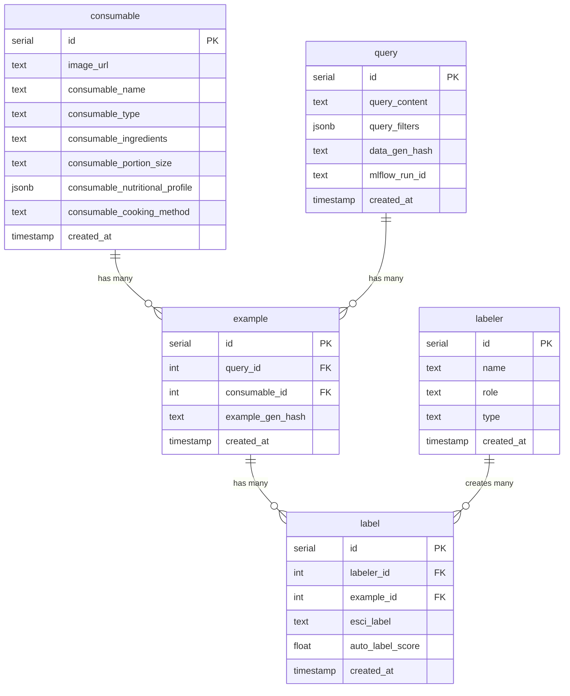

# CLAUDE.md

This file provides guidance to Claude Code (claude.ai/code) when working with code in this repository.

## Project Overview

This is an **ESCI dataset generation system** for benchmarking food delivery search queries. The project generates synthetic query-food relevance data using AI, tracks experiments with MLflow, and provides annotation tools for creating high-quality training datasets.

## Development Commands

### Environment Setup
```bash
# Use uv for dependency management
uv sync                           # Install dependencies
uv run python <script>           # Run scripts in venv
```

### Core Operations (via Makefile)
```bash
# Data Pipeline
make load-consumables INPUT=data.csv THRESHOLD=0.9
make generate-queries ESCI=S LIMIT=1000 BATCH_SIZE=50
make approve-runs RUNS='run1 run2'
make migrate-data EXPERIMENT=Initial_Generation
make summary

# Code Quality
make format                      # Ruff formatting
make ruff-check                 # Linting
```

### Generation Workflows
```bash
# Direct approach (food → query)
./run_initial_generation.sh

# Intent-driven approach (intent → matching → query)
./run_intent_generation.sh

# Database migration from MLflow
./run_migrate_synthetic_data.sh

# Annotation interface
./run_annotation_app.sh
```

## Architecture Overview

### Data Flow
```
Food Catalog → Dietary Evaluation → LLM Generation → MLflow Tracking →
Manual Review → Approval → Database Migration → ESCI Annotation
```

### Two Generation Approaches

**Initial Generation (Direct)**:
- Loads food items from `consumable` table
- Applies rule-based dietary classification
- Generates queries directly using food context
- Processes in configurable batches

**Intent Generation (3-Step)**:
1. **Step 1**: Generate pure user intents (no food bias)
2. **Step 2**: Smart 1:1 matching of foods to intents
3. **Step 3**: Create both intent queries and food-aware queries
- Uses 10 themed intent sets for diversity

### Database Schema



**Key Tables**:
- **`consumable`**: Food catalog with nutritional/dietary metadata
- **`query`**: Generated search queries with structured `query_filters`
- **`example`**: Query-food relevance pairs
- **`label`**: ESCI annotations (Exact/Substitute/Complement/Irrelevant)
- **`labeler`**: Tracks data generation provenance by git hash

### MLflow Integration
- **Experiments**: `Initial_Generation`, `Intent_Generation`
- **Approval workflow**: `pending_review → approved → migrated`
- **Comprehensive tracking**: Parameters, metrics, artifacts, git hashes
- **Migration support**: Full and partial (bridged) runs

## Key Configuration

### Environment Variables (.env)
- **API Keys**: `OPENAI_API_KEY`, `SUPABASE_*`
- **Database**: Connection credentials
- **Paths**: `root_folder`, `data_folder`, `labeler_id`

### Dietary Classification (src/constants.py)
Rule-based ingredient analysis using predefined taxonomies:
- `SEAFOOD`, `NON_SEAFOOD_NON_VEG`, `MILK`, `GLUTEN`, etc.

### Intent Sets (intent_sets/)
10 themed categories for diverse query generation:
- Quick & Convenient, Health & Wellness, International Cuisine, etc.

## Data Generation Patterns

### Query Enhancement
Combines LLM dimensions with rule-based dietary restrictions:
```json
{
  "dimensions": {"cuisine": "Indian", "meal_type": "Dinner"},
  "rule_based_dietary_restrictions": ["Vegetarian", "Gluten-Free"]
}
```

### Batch Processing
- Configurable batch sizes (default: 50)
- Resumable with `start_idx` parameter
- Parallel processing support
- Comprehensive error handling and retry logic

### Quality Control
- Dry-run capabilities for all major operations
- Git hash tracking for data provenance
- MLflow experiment comparison
- Manual annotation interface for ground truth

## Important Scripts

### Analysis & Reporting
- **`scripts/mlflow_runs_summary.py`**: Generate migration summaries with ESCI labels and git hashes
- **`database/queries/run_wise_counts.sql`**: Verify migration integrity
- **`database/scripts/rollback_synthetic_data.py`**: Rollback migrations safely

### Database Management
- **Migration**: Sequential numbered SQL files in `database/migration/`
- **Rollback support**: Comprehensive rollback scripts
- **Bridged migrations**: Partial data migration for specific runs

## Development Notes

- **Modern Python**: Uses `uv` package manager, Pydantic models, type hints
- **AI Stack**: DSPy for structured LLM I/O, OpenAI GPT models
- **Data Stack**: Polars/Pandas processing, PostgreSQL with JSON fields
- **Experiment tracking**: MLflow with comprehensive parameter/metric logging
- **Code quality**: Ruff linting/formatting, structured error handling